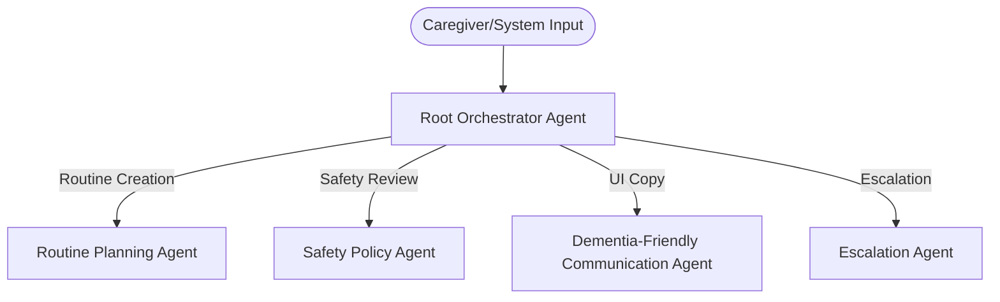

# Agents & Routing

## Google ADK Multi-Agent Hierarchy

The agent architecture uses a Root Orchestrator and specialized sub-agents. It enforces strict routing, preventing semantic interpretation from bypassing deterministic rules and human review.

### 1. Root Orchestrator Agent
**Responsibility:** Identify user intent, route to the correct specialized agent, enforce required sequence (Plan -> Safety -> Comm -> Approve), and block bypassing checkpoints.
**Data Access:** None directly. Only uses MCP tools.

### 2. Routine Planning Agent
**Responsibility:** Transform natural language into a structured routine (max 5 steps). Identifies missing information and enforces structure without inferring facts.

### 3. Safety Policy Agent
**Responsibility:** Classify routine safety into Low, Medium, or Prohibited. Explains policy decisions. Applies deterministic checks first, then semantic review.

### 4. Dementia-Friendly Communication Agent
**Responsibility:** Transform approved draft instructions into accessible, clear, respectful language (one step per sentence, no metaphors).

### 5. Escalation Agent
**Responsibility:** Handle requests for help or overdue routines. Generates in-app caregiver alerts securely without contacting external emergency services.

---

## Agent Skills (`SKILL.md`)

Each specialized agent has an associated skill file containing instructions, trigger conditions, boundaries, and prompt budgets.

### `routine-structuring`
* **Purpose:** Transform caregiver input into a small, structured routine (max 5 steps, one action per step) without inventing details.
* **Positive Triggers:** "Create a routine for watering the plants at 10", "Remind Maria to call Anna".
* **Negative Triggers:** "Approve this routine", "Send an emergency message".
* **Boundaries:** Must leave `missing_information` array populated instead of assuming times, places, or contacts.

### `dementia-friendly-communication`
* **Purpose:** Rewrite approved content into clear, respectful, low-cognitive-load language.
* **Positive Triggers:** "Draft user UI text for this task".
* **Negative Triggers:** "Classify this risk".
* **Boundaries:** Short sentences, one action per sentence. No false certainty. No childish tone. No medical jargon. 

### `caregiver-escalation`
* **Purpose:** Process trigger conditions (user presses help, missed routines) to create in-app alerts.
* **Positive Triggers:** "Maria pressed Help me", "Routine not completed after grace period".
* **Negative Triggers:** "Call 911", "Email the doctor".
* **Boundaries:** Never contact unapproved external systems. Only interacts with `create_caregiver_alert` MCP tool.

### `accessible-ui-copy`
* **Purpose:** Generate concise labels, error messages, and confirmations for the accessible assisted-user UI.
* **Positive Triggers:** "Generate label for the done button".
* **Negative Triggers:** "Write a routine".
* **Boundaries:** Keeps text extremely short, high readability index.
