# MemoryBridge

**A safety-first assistive prototype for people living with early-stage dementia and their caregivers.**

[](LICENSE)
[](#)

---

## 1. Problem Statement & Why It Matters

Caregivers for individuals with early-stage dementia often struggle to maintain structured daily routines without being overly intrusive. Missed routines (like drinking water or taking medication) can lead to severe health decline, while over-monitoring can strip the assisted user of their dignity and autonomy. The core problem is **balancing independent living with verifiable safety**.

This matters because millions of families face caregiver burnout while trying to provide a safe, respectful environment for their loved ones.

## 2. Target Users

- **Assisted Users (e.g., Maria):** Individuals with early-stage dementia or cognitive decline who benefit from simple, accessible, and structured daily reminders.
- **Caregivers (e.g., Anna):** Family members or professional caregivers who need to schedule routines, verify completion, and receive help alerts remotely.

## 3. Solution Overview

MemoryBridge is a multi-agent system that helps caregivers draft, evaluate, and schedule safe daily routines. It translates complex caregiver intents into highly accessible, dementia-friendly instructions for the assisted user. Crucially, the system enforces strict structural and semantic safety policies to ensure the AI never schedules harmful actions (like altering medication dosages).

### Key Product Flows
1. **Routine Creation:** Caregiver inputs a natural language request (e.g., "Remind Maria to water the plants at 10 AM").
2. **Safety Review:** The AI generates a structured draft and evaluates its safety. Prohibited actions are automatically rejected.
3. **Human Approval:** Low-risk routines are presented to the caregiver for explicit approval.
4. **Accessible Delivery:** The approved routine appears on the assisted user's simplified `/today` portal with text-to-speech functionality.
5. **Caregiver Alerts:** If the assisted user presses "Help me" or misses a routine, the Escalation Agent immediately notifies the caregiver.

---

## 4. Why an Agent Architecture?

An agent architecture is appropriate because translating free-form caregiver requests into safe, structured routines requires **reasoning, multi-step planning, and semantic evaluation**. Hard-coded rules cannot reliably parse natural language intents (e.g., distinguishing between "take your daily pill" and "take an extra pill"). Agents provide the necessary semantic understanding, while our deterministic safeguards ensure they operate within strict bounds.

## 5. Multi-Agent Architecture & Google ADK

MemoryBridge is orchestrated using the **Google Agent Development Kit (ADK)**.
A Root Orchestrator directs specialized sub-agents:
- **Routine Planning Agent:** Transforms natural language into structured steps.
- **Semantic Safety Reviewer:** Evaluates the risk level of the proposed routine.
- **Dementia-Friendly Communication Agent:** Rewrites instructions for high readability and low cognitive load.
- **Escalation Agent:** Handles "Help me" requests and missed routines.

## 6. MCP Server and Agent Skills

The agents never access the database directly. Instead, they interact with a local **Model Context Protocol (MCP)** server via stdio. The MCP server exposes tools (e.g., `create_routine_draft`, `list_caregiver_routines`) that encapsulate all database operations and deterministic safety gates.

Each agent is guided by strict **Agent Skills** (defined in `SKILL.md` files) which define their exact boundaries, positive/negative triggers, and interaction rules.

## 7. Security, Privacy, and Human-in-the-Loop

- **Human-in-the-Loop:** No routine becomes active without explicit caregiver approval. The AI can only draft and propose.
- **Deterministic Safeguards:** Before the Semantic Safety Reviewer even runs, an algorithmic check rejects routines containing prohibited keywords (e.g., "medication", "dose").
- **Privacy Design:** The backend API is entirely private (authenticated via server-to-server OIDC). The browser never receives the backend tokens.

## 8. Observability and Audit Trail

Every state change (draft creation, safety decision, human approval, alert generation) is logged as an immutable **Audit Event**. Caregivers can view this exact timeline in the dashboard, ensuring complete transparency into how the AI arrived at a specific routine.

---

## 9. Technology Stack

- **Frontend:** Next.js 16 (React, TailwindCSS, Lucide Icons)
- **Backend:** FastAPI (Python 3.11)
- **Agent Orchestration:** Google ADK (Agent Development Kit) 2.3.x
- **LLM Provider:** Google Gemini (`gemini-2.5-flash`)
- **Integration:** Model Context Protocol (MCP) via stdio
- **Database:** Neon PostgreSQL (SQLAlchemy + Alembic)
- **Deployment:** Google Cloud Run (Serverless)

---

## 10. Architecture Diagram



---

## 11. Public Demo

**Caregiver Portal:**
[https://memorybridge-web-707123898547.europe-west3.run.app/](https://memorybridge-web-707123898547.europe-west3.run.app/)

**Assisted-User Portal (Maria's View):**
[https://memorybridge-web-707123898547.europe-west3.run.app/today](https://memorybridge-web-707123898547.europe-west3.run.app/today)

### Demo Access Instructions
The public demo uses static session credentials for the hackathon evaluation.
1. Navigate to the Caregiver Portal URL.
2. The login screen provides a "Login as Anna (Caregiver)" button.
3. Clicking this button automatically securely authenticates the session and loads the dashboard.
*(Note: No passwords or bearer tokens need to be manually entered or exposed.)*

---

## 12. Evaluation Approach & Key Results

We evaluated MemoryBridge during Phase 5 using automated tests with a deterministic `fake` model to test the scaffolding, and live API tests against the Gemini models.

**Key Results (Verified in Phase 5 Acceptance):**
- **Safety Classification:** 100% success in detecting and rejecting prohibited actions (e.g., medication changes) using both deterministic gates and semantic review.
- **Approval Bypass Prevention:** 100% success; the system strictly enforces that routines cannot transition to active without human approval.
- **Accessibility:** Axe-core reported 0 violations on the `/today` assisted-user interface.
- **Prompt Injection:** Successfully resisted 5/5 prompt injection attempts designed to bypass the safety reviewer.

*(These results reflect the structured automated evaluation pipeline results executed prior to deployment).*

---

## 13. Local Setup & Required Environment Variables

### Environment Variables (`.env`)
```bash
cp .env.example .env
```
Required variables:
- `DATABASE_URL`: PostgreSQL connection string (pooled).
- `GOOGLE_API_KEY`: Your Gemini API Key.
- `SESSION_SECRET`: A 32+ character random string for Next.js iron-session.
- `DEMO_CAREGIVER_TOKEN`: A secure token for caregiver API access.
- `DEMO_ASSISTED_USER_TOKEN`: A secure token for assisted-user API access.

### Backend Setup (FastAPI & MCP)
```bash
# Setup MCP dependencies
cd services/mcp-routines
python -m venv venv && source venv/bin/activate
pip install -r requirements.txt
alembic upgrade head
python ../../scripts/seed_demo_data.py

# Setup Agent API
cd ../agent-api
python -m venv .venv && source .venv/bin/activate
pip install -e ".[dev]"
uvicorn src.memorybridge_agent.main:app --port 8000
```

### Frontend Setup (Next.js)
```bash
cd apps/web
npm install
npm run dev -- -p 3000
```

---

## 14. Deployment & Testing Commands

### Cloud Run Deployment
MemoryBridge is built as two Cloud Run services: a public web frontend and a private backend.

```bash
# Deploy Backend (Private)
./infra/cloudrun/deploy-backend.sh --project YOUR_PROJECT --region YOUR_REGION

# Deploy Web (Public)
./infra/cloudrun/deploy-web.sh --project YOUR_PROJECT --region YOUR_REGION --backend-url BACKEND_URL
```

### Test & Evaluation Commands
```bash
# Web Unit Tests
cd apps/web && npm test

# Agent API & MCP Tests
cd services/mcp-routines && PYTHONPATH=. ./venv/bin/pytest
cd services/agent-api && ./.venv/bin/pytest

# Run E2E Evaluations
cd scripts && AGENT_PROVIDER=fake PYTHONPATH=../services/agent-api/src python run_evals.py
```

---

## 15. Known Limitations & Future Work

**Limitations:**
- **Demo Sandbox:** The application is loaded with synthetic data only. Notifications (SMS/Email) are mocked as in-app alerts.
- **Rate Limiting:** Currently uses an in-memory rate limiter, which is insufficient for a multi-instance production deployment.

**Future Work:**
- **Agent Engine Integration:** Migrating the local Google ADK orchestration to Google Cloud Agent Engine for persistent, managed agents.
- **OAuth/OIDC:** Replacing the static demo tokens with a full identity provider (e.g., Google Identity).
- **Wearable Integration:** Connecting the Escalation Agent to smartwatch telemetry for proactive fall detection or wandering alerts.

---

## 16. Responsible-Use Statement

MemoryBridge is an educational prototype submitted to the Agents for Good hackathon. **It is not a medical device.** It does not diagnose, treat, or manage health conditions, and it is strictly prevented from providing medical advice or contacting real emergency services.

Users must not input real Protected Health Information (PHI) into this prototype.

---

## 17. Repository Structure

```text
memorybridge/
├── apps/
│   └── web/                   # Next.js 16 frontend
├── services/
│   ├── agent-api/             # FastAPI + Google ADK agent orchestrator
│   └── mcp-routines/          # Model Context Protocol server (DB access)
├── infra/
│   └── cloudrun/              # Deployment and migration scripts
├── scripts/                   # Evaluation and seeding scripts
├── specs/                     # Project specifications and acceptance reports
├── submission/                # Kaggle submission materials and media
├── AGENTS.md                  # Detailed agent routing and responsibilities
├── SECURITY.md                # Vulnerability reporting guidelines
└── CONTRIBUTING.md            # Contribution guidelines
```
