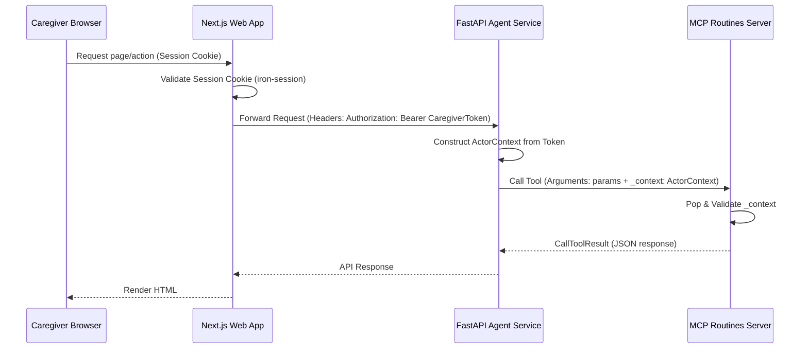

# System Architecture Spec

## 1. System Overview

MemoryBridge is organized as a monorepo containing three primary systems:
1. **Next.js Web Interface** (`apps/web`): Portal serving Caregiver dashboard views.
2. **FastAPI Agent Service** (`services/agent-api`): The intelligent routing gateway powered by Google ADK.
3. **MCP Routines Server** (`services/mcp-routines`): A sandboxed server enforcing deterministic data persistence into Neon PostgreSQL.

---

## 2. Request and Data Flow

### Routine Interpretation Flow:
1. Caregiver submits natural language text via the Next.js UI (`/caregiver/routines/new`).
2. Next.js server actions call `POST /api/routines/interpret` on the FastAPI Agent Service.
3. The gateway invokes the ADK **Routine Planning Agent** to extract a structured plan.
4. Output passes to the **Safety Policy Agent** for deterministic and semantic checks.
5. If allowed, output passes to the **Communication Agent** for dementia-friendly rewrites.
6. The service persists the non-active draft via the MCP Server's `create_routine_draft` tool.
7. Next.js displays the draft details on the review page (`/caregiver/routines/[id]`).

### Routine Approval Flow:
1. Caregiver reviews the draft, confirms the safety validation, and checks the activation review.
2. Next.js triggers the server action `approveDraft`, calling `POST /api/routines/{id}/approve` on the gateway.
3. Gateway invokes the MCP `approve_routine` tool.
4. The tool validates caregiver scope, marks the routine as active, and records an audit event.

---

## 3. Security Boundary & Context Injection

### Next.js Dynamic Parameters (Next.js 16):
- In Next.js 16, route parameters (`params` in `page.tsx`) are asynchronous.
- The details page awaits the `params` promise (`const { routineId } = await params`) before calling `getRoutine`, avoiding dynamic parameter bugs.

### MCP Additional Properties Schema:
- To allow the FastAPI gateway to safely inject the `_context` parameter, the MCP tool schemas are registered with `"additionalProperties": true`.
- However, direct schema validations inside the MCP server business logic utilize Pydantic models configured with `extra="ignore"` on `ActorContext` to handle context attributes, and `extra="forbid"` on other data schemas, protecting against arbitrary injection.
