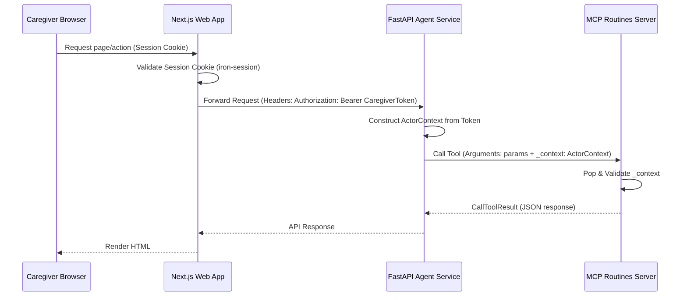

# System Architecture Spec

## 1. System Overview

MemoryBridge is organized as a monorepo containing three primary systems:
1. **Next.js Web Interface** (`apps/web`): Portal serving Caregiver dashboard views and the accessible assisted-user `/today` view.
2. **FastAPI Agent Service** (`services/agent-api`): The intelligent routing gateway powered by Google ADK.
3. **MCP Routines Server** (`services/mcp-routines`): A sandboxed server enforcing deterministic data persistence into Neon PostgreSQL.

---

## 2. Request and Data Flow

### Routine Interpretation Flow:
1. Caregiver submits natural language text via the Next.js UI (`/caregiver/routines/new`).
2. Next.js server actions call `POST /api/routines/interpret` on the FastAPI Agent Service.
3. The gateway invokes the ADK **Routine Planning Agent** to extract a structured plan.
4. Output passes to the **Safety Policy Agent** for deterministic and semantic checks.
5. If allowed, output passes to the **Communication Agent** for dementia-friendly rewrites.
6. The service persists the non-active draft via the MCP Server's `create_routine_draft` tool.
7. Next.js displays the draft details on the review page (`/caregiver/routines/[id]`).

### Routine Approval Flow:
1. Caregiver reviews the draft, confirms the safety validation, and checks the activation review.
2. Next.js triggers the server action `approveDraft`, calling `POST /api/routines/{id}/approve` on the gateway.
3. Gateway invokes the MCP `approve_routine` tool.
4. The tool validates caregiver scope, marks the routine as active, and records an audit event.

---

## 3. Security Boundary & Context Injection



### Next.js Dynamic Parameters (Next.js 16):
- In Next.js 16, route parameters (`params` in `page.tsx`) are asynchronous.
- The details page awaits the `params` promise (`const { routineId } = await params`) before calling `getRoutine`, avoiding dynamic parameter bugs.

### MCP Additional Properties Schema:
- To allow the FastAPI gateway to safely inject the `_context` parameter, the MCP tool schemas are registered with `"additionalProperties": true`.
- However, direct schema validations inside the MCP server business logic utilize Pydantic models configured with `extra="ignore"` on `ActorContext` to handle context attributes, and `extra="forbid"` on other data schemas, protecting against arbitrary injection.

---

## 4. Phase 6 Deployment Architecture

```text
                        ┌──────────────────────────────────────┐
                        │          Public Internet              │
                        └──────────────┬───────────────────────┘
                                       │ HTTPS
                        ┌──────────────▼───────────────────────┐
                        │   Cloud Run: memorybridge-web         │
                        │   (PUBLIC — browser entry point)      │
                        │   Next.js standalone server           │
                        │   SA: memorybridge-web-sa             │
                        └──────────────┬───────────────────────┘
                                       │ Cloud Run IAM (server-side only)
                        ┌──────────────▼───────────────────────┐
                        │   Cloud Run: memorybridge-backend     │
                        │   (PRIVATE — no public access)        │
                        │   FastAPI Agent API                   │
                        │   MCP server subprocess (stdio)       │
                        │   SA: memorybridge-backend-sa         │
                        └──────────────┬───────────────────────┘
                                       │ postgresql+ssl
                        ┌──────────────▼───────────────────────┐
                        │   Neon PostgreSQL (managed)           │
                        │   Project: MemoryBridge               │
                        └──────────────────────────────────────┘
```

### Key design decisions

| Decision | Rationale |
|----------|-----------|
| MCP server runs as a subprocess inside the backend container | Preserves existing stdio transport; avoids a separate public service; keeps the trust boundary intact |
| Backend is private (no unauthenticated access) | Browser never contacts the backend directly; web SA authenticates via Cloud Run IAM |
| Secrets in Secret Manager | Never in Dockerfiles, source code, or environment variable literals |
| Neon pooled URL at runtime, direct URL for migrations | Pooled (PgBouncer) is incompatible with Alembic DDL; separate URL avoids breakage |
| `MEMORYBRIDGE_MODEL` is not a secret | Model identifier is not sensitive; configured as a plain env var, not in Secret Manager |

### Optional future work

- **Agent Engine / Agent Runtime**: Deploying agents to Vertex AI Agent Engine would allow managed scaling and agent lifecycle management. This requires migrating from the current custom ADK workflow to an Agent Engine-compatible runner. Deferred to post-MVP.
- **Redis rate limiter**: Replace in-memory rate limiter with a shared Redis-backed store for multi-instance Cloud Run deployments.
- **Nonce-based CSP**: Replace `unsafe-inline` in Content-Security-Policy with a nonce-based approach for stronger XSS protection.
