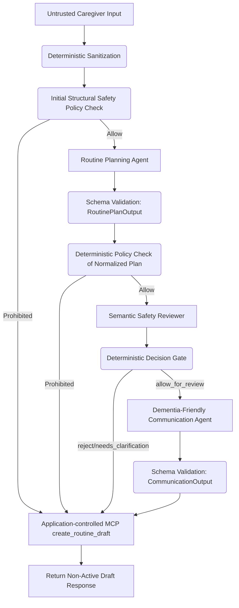

# Phase 2 Acceptance Gate and Caregiver UI Readiness Audit

This document certifies that MemoryBridge has successfully passed the Phase 2 acceptance criteria and is fully ready for the Phase 3 Next.js interface implementation.

## 1. Verified Workflow Trajectory

The routine interpretation workflow (`POST /api/routines/interpret`) follows the strict deterministic and semantic sequence mandated by the specifications:



This ensures:
1. **Initial Sanitization** occurs before any model receives inputs.
2. **Structural Checks** (medication, finance, emergency services keywords) run twice: first on caregiver text, and again on normalized outputs.
3. **Semantic checks** act as a second barrier for nuanced risks (sharp objects, kitchen safety, etc.).
4. **Fail-Closed Gate** automatically falls back to prohibited/rejected state on any model timeouts or schema failures.

---

## 2. Endpoint Inventory

The following public endpoints are fully implemented and available in the Agent API service:

| Method | Path | Request Body | Auth Role | Description |
|--------|------|--------------|-----------|-------------|
| `POST` | `/api/routines/interpret` | `CaregiverInputSchema` | Caregiver | Evaluates text, runs ADK graph, and creates draft routine. |
| `GET` | `/api/routines/{routine_id}` | None | Caregiver/Assisted User | Retrieves details of a specific routine. Enforces relationship scope. |
| `PATCH` | `/api/routines/{routine_id}` | `UpdateRoutineInput` | Caregiver | Updates details of an unapproved draft. Reruns safety policy checks. |
| `POST` | `/api/routines/{routine_id}/approve` | `ApproveRoutineInput` | Caregiver | Confirms and activates a draft routine. Involves **zero LLM calls**. |
| `POST` | `/api/routines/{routine_id}/reject` | None | Caregiver | Rejects and invalidates a draft routine. Involves **zero LLM calls**. |
| `GET` | `/api/caregivers/me/routines` | Query parameters | Caregiver | Lists all routines of the caregiver's assisted users with filters. |
| `GET` | `/api/caregivers/me/alerts` | None | Caregiver | Retrieves all alerts related to the caregiver's assisted users. |
| `GET` | `/api/audit/{correlation_id}` | None | Caregiver | Retrieves a redacted timeline of audit events. |
| `GET` | `/health`, `/api/health` | None | Public | Returns service health status. |
| `GET` | `/ready`, `/api/ready` | None | Public | Returns service readiness status. |

---

## 3. Caregiver UI Readiness Matrix

All capabilities requested by the Caregiver UI have been implemented and verified:

| Capability Required | API Operation | Status | Verification Proof |
|---------------------|---------------|--------|---------------------|
| Interpret & create non-active draft | `POST /api/routines/interpret` | **Passed** | Tests verify draft state is `draft` / `pending_approval`. |
| Retrieve routine by ID | `GET /api/routines/{routine_id}` | **Passed** | Verification enforces caregiver relationship. |
| List caregiver routines | `GET /api/caregivers/me/routines` | **Passed** | Filters by status and assisted user ID, isolates other caregivers. |
| Update unapproved draft | `PATCH /api/routines/{routine_id}` | **Passed** | Reruns safety, resets approval state on content changes. |
| Reject unapproved draft | `POST /api/routines/{routine_id}/reject` | **Passed** | Idempotently sets status to `rejected`, blocks later approval. |
| Approve allowed draft | `POST /api/routines/{routine_id}/approve` | **Passed** | Strictly deterministic activation. No LLM calls. |
| Retrieve caregiver alerts | `GET /api/caregivers/me/alerts` | **Passed** | Only fetches active relationship alerts. |
| Retrieve redacted audit log | `GET /api/audit/{correlation_id}` | **Passed** | Removes prompts/system instructions, exposes decision & tool. |

---

## 4. Test Commands and Results

### Test Suite Execution

#### 1. Agent API Service Unit and Integration Tests
```bash
cd services/agent-api
./.venv/bin/pytest
```
* **Result:** `10 passed in 0.83s`
* **Coverage:**
  - `test_root_health_and_readiness`: Verifies routing under `/` and `/api` prefixes.
  - `test_auth_missing_or_invalid`: Assures Bearer token enforcement.
  - `test_get_routine_success`: Verifies `ActorContext` parameter injection.
  - `test_update_routine_patch`: Asserts payload serialization and update schema bounds.
  - `test_reject_routine_post`: Assures rejection is correctly propagated.
  - `test_list_caregiver_routines`: Asserts caregiver scopes.
  - `test_zero_llm_calls_on_rejection_and_approval`: Confirms zero model calls.
  - `test_no_database_imports`: Asserts total separation from database components.

#### 2. MCP Server Core Unit Tests
```bash
cd services/mcp-routines
PYTHONPATH=. ./venv/bin/pytest tests/test_mcp.py
```
* **Result:** `19 passed in 0.30s`
* **Coverage:**
  - `test_get_routine_authorization`: Asserts that unrelated caregivers cannot view routines.
  - `test_update_routine_validation_and_reclassification`: Reruns deterministic policy and rejects prohibited content updates (e.g. "Take Medication").
  - `test_reject_routine_idempotence`: Verifies rejections are idempotent and block approvals.
  - `test_list_caregiver_routines`: Validates status filtering and active user relationship scope.
  - `test_get_audit_events_redaction`: Confirms internal prompts are redacted and cannot leak to unauthorized actors.

#### 3. Verification of Formatting, Linting, & Types
```bash
# Type Checking (Passed)
PYTHONPATH=src ../mcp-routines/venv/bin/mypy --python-executable=.venv/bin/python src (Agent API)
PYTHONPATH=. ./venv/bin/mypy --package src (MCP Server)

# Formatting and Linting (Passed)
./venv/bin/flake8 src tests (MCP Server)
```

---

## 5. Security & Boundary Verification

1. **Zero Database Dependency in `agent-api`:** 
   - Architecturally validated by `tests/test_architecture.py`. 
   - No `SQLAlchemy`, raw SQL, or database imports are present in `agent-api`.
2. **ActorContext Protection:**
   - The `ActorContext` is formed entirely server-side in FastAPI dependencies from bearer tokens.
   - It is injected as a hidden `_context` parameter into the stdio MCP JSON-RPC call.
   - It never appears in the published model-visible schemas, preventing model bypass or header spoofing.
3. **Redacted Timeline Audit:**
   - Exposes only safe fields (`tool_name`, `event_type`, `decision`, `created_at`).
   - Redacts system prompts, instructions, model parameters, and credentials.

---

## 6. Phase 3 API Contract

### Interface: Routine Model
```json
{
  "id": "string (UUID)",
  "assisted_user_id": "string (UUID)",
  "title": "string",
  "purpose": "string | null",
  "scheduled_time": "string (HH:MM)",
  "timezone": "string",
  "steps_json": ["string"],
  "risk_level": "low | medium | prohibited",
  "safety_decision": "allow_for_review | reject_medium_risk | reject_prohibited",
  "approval_status": "pending | approved | rejected",
  "status": "draft | active | completed | help_requested | missed | rejected"
}
```

### Interface: Rejection Response
```json
{
  "status": "rejected",
  "routine_id": "string (UUID)"
}
```

### Interface: Approval Response
```json
{
  "status": "active",
  "routine_id": "string (UUID)"
}
```

### Interface: Redacted Audit Timeline
```json
[
  {
    "id": "string (UUID)",
    "correlation_id": "string (UUID)",
    "tool_name": "string",
    "event_type": "string",
    "decision": "string",
    "metadata": {
      "routine_id": "string (UUID)",
      "risk_level": "string",
      "policy_reasons": ["string"],
      "content_changed": "boolean"
    },
    "created_at": "string (ISO-8601)"
  }
]
```

### Interface: Alert Model
```json
[
  {
    "id": "string (UUID)",
    "caregiver_user_id": "string (UUID)",
    "message": "string",
    "status": "unread | read"
  }
]
```
